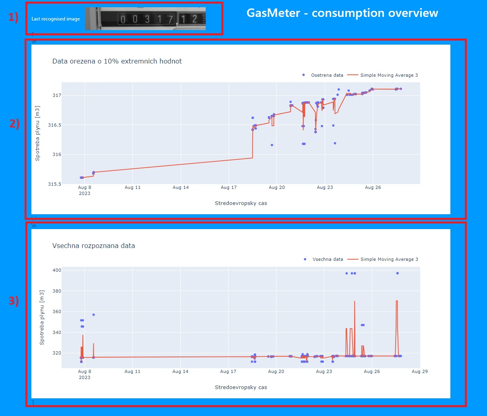

# Software system, that solves the problem of getting gas usage read from Gas Meter.

This application uses Raspberry Pi for capturing photos, 
Laravel app to serve as data storage for images
and 
Django application, that process all images and extract the gas usage from them. As well it 
shows the results in form of interactive plots on online webpage.

1) - last captured image, where the gas consumption wes recognized and considered valid.
2) - Interactive plot, that shows all recognised and saved gas consumption values. Simple Moving Average added.
3) - Interactive plot of processed data - extreme values are removed. Simple Moving Average added. 

For each subsystem there is a separate README.md file, that describes how to setup and run it.

## Contributing

Contributions are welcome!

## License

This project is licensed under the MIT License.
